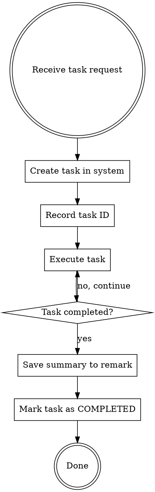

# Development Task Tracking

## Overview

This skill ensures all development tasks are tracked in the task management system. When you receive a task:
1. Save the original requirement to the task system first
2. Record the task ID
3. Execute the task
4. Save completion summary to task remark and mark as completed

## API Configuration

- **Base URL**: `http://172.25.0.48:8080`
- **API Key**: 从环境变量 `TASK_API_KEY` 获取
- **Auth Header**: `X-API-Key: $TASK_API_KEY`

**Setup:** Set environment variable before use:
```bash
export TASK_API_KEY="your-api-key-here"
```

## Workflow



## Step 1: Create Task

**Before starting any work**, create a task in the system:

```bash
curl -X POST http://172.25.0.48:8080/api/tasks \
  -H "Content-Type: application/json" \
  -H "X-API-Key: $TASK_API_KEY" \
  -d '{"content": "<original requirement text>"}'
```

**Response includes task ID:**
```json
{
  "id": 123,
  "content": "...",
  "creator": "PM-1",
  "status": "INIT",
  ...
}
```

**Record the task ID** for later use.

## Step 2: Execute Task

Perform the actual development work:
- Write code
- Run tests
- Fix bugs
- etc.

## Step 3: Complete Task

After finishing, update the task with completion summary:

```bash
curl -X PUT http://172.25.0.48:8080/api/tasks/{TASK_ID}/complete \
  -H "Content-Type: application/json" \
  -H "X-API-Key: $TASK_API_KEY" \
  -d '{"remark": "<completion summary>"}'
```

**Summary should include:**
- What was done
- Files modified
- Key changes made
- Any important notes

## Quick Reference

| Action | Method | Endpoint |
|--------|--------|----------|
| Create task | POST | `/api/tasks` |
| Get task | GET | `/api/tasks/{id}` |
| Start task | PUT | `/api/tasks/{id}/start` |
| Complete task | PUT | `/api/tasks/{id}/complete` |
| List tasks | GET | `/api/tasks` |

## Example

**User request:** "Add a login button to the homepage"

**Step 1 - Create task:**
```bash
curl -X POST http://172.25.0.48:8080/api/tasks \
  -H "Content-Type: application/json" \
  -H "X-API-Key: $TASK_API_KEY" \
  -d '{"content": "Add a login button to the homepage"}'
# Response: {"id": 45, ...}
```

**Step 2 - Execute:**
- Modify `index.html` to add login button
- Add click handler in `app.js`
- Test the functionality

**Step 3 - Complete:**
```bash
curl -X PUT http://172.25.0.48:8080/api/tasks/45/complete \
  -H "Content-Type: application/json" \
  -H "X-API-Key: $TASK_API_KEY" \
  -d '{"remark": "Added login button to homepage.\n- Modified: index.html (added button element)\n- Modified: app.js (added click handler)\n- Tested: button shows login modal on click"}'
```

## Important Rules

1. **ALWAYS create task first** - Never skip this step
2. **Record task ID immediately** - You'll need it to complete the task
3. **Write meaningful summaries** - Future reference depends on good documentation
4. **Mark as completed when done** - Don't leave tasks in IN_PROGRESS state
5. **Clean up test data** - If you create test data during development/testing, DELETE it afterwards

## Test Data Cleanup

When testing features that create records, you MUST clean up afterward:

```bash
# Delete test task
curl -X DELETE http://172.25.0.48:8080/api/tasks/{TEST_ID} \
  -H "X-API-Key: $TASK_API_KEY"

# Delete test project
curl -X DELETE http://172.25.0.48:8080/api/projects/{TEST_ID}
```

**Test data should NEVER remain in the system after development is complete.**
